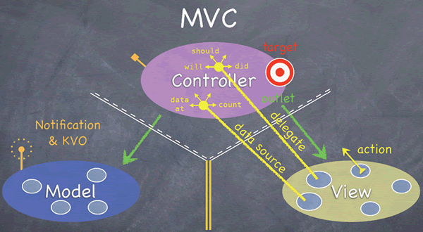
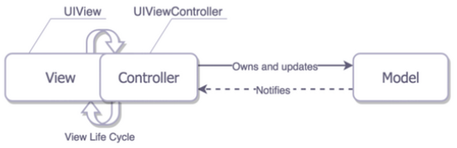
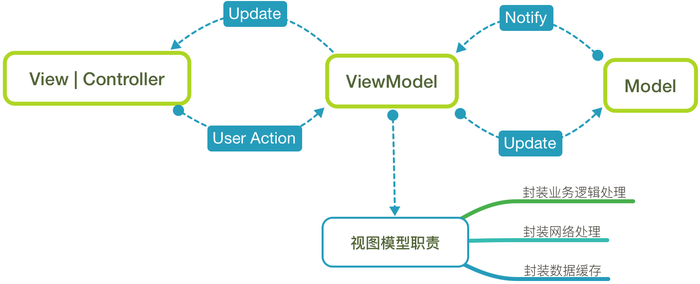
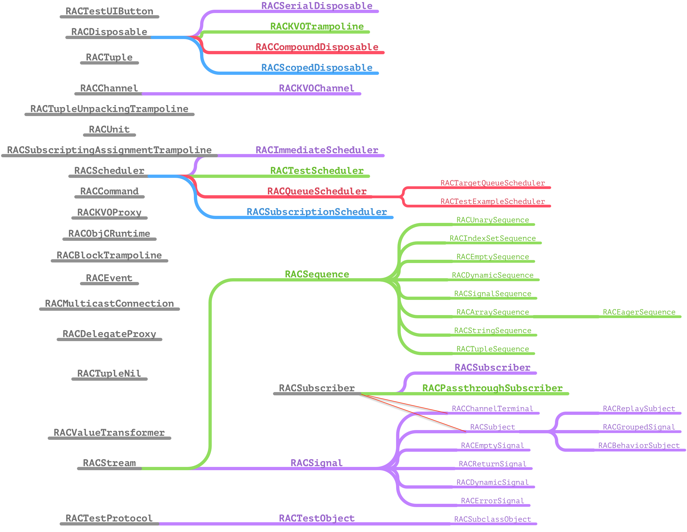
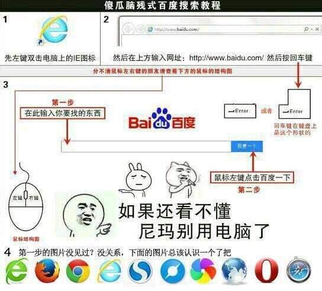

# MVVM+RAC简单使用

## MVC和MVVM

### 什么是MVC？

Modal View Controller、Apple官方推荐的设计模式

#### MVC理想模型如下



* Model 和 View 永远不能相互通信，只能通过 Controller 传递。

* Controller 可以直接与 Model 对话（读写调用 Model），Model 通过 Notification 和 KVO 机制与 Controller 间接通信。

* Controller 可以直接与 View 对话，通过 outlet，直接操作 View，outlet 直接对应到 View 中的控件，View 通过 action 向 Controller 报告事件的发生(如用户 Touch 我了)。Controller 是 View 的直接数据源（数据很可能是 Controller 从 Model 中取得并经过加工了）。Controller 是 View 的代理（delegate)，以同步 View 与 Controller。

各层的职责如下所示：

* Models： 数据层，负责数据的处理和获取的数据接口层。
* Views： 展示层(GUI)，对于 iOS 来说所有以 UI 开头的类基本都属于这层。
* Controller： 控制器层，它是 Model 和 View 之间的胶水或者说是中间人。一般来说，当用户对 View 有操作时它负责去修改相应 Model；当 Model 的值发生变化时它负责去更新对应 View。


#### apple里面的MVC真正写起来大概如下图所示：



Cocoa 的 MVC 模式驱使人们写出臃肿的视图控制器，因为它们经常被混杂到 View 的生命周期中，因此很难说 View 和 ViewController 是分离的。尽管仍可以将业务逻辑和数据转换到 Model，但是大多数情况下当需要为 View 减负的时候我们却无能为力了，View 的最大的任务就是向 Controller 传递用户动作事件。

我们可以看到在纯粹的MVC设计模式中，Controller不得不承担大量的工作：

* 网络API请求
* 数据读写
* 日志统计
* 数据的处理（JSON<=>Object，数据计算）
* 对View进行布局，动画
* 处理Controller之间的跳转（push/modal/custom）
* 处理View层传来的事件，返回到Model层
* 监听Model层，反馈给View层

重新解读MVC：
Massive View Controller(重量级视图控制器)
 
 
### 什么是MVVM？

为了避免和解决上述问题的产生，从MVC引申出来一种维护性较强、耦合性低的新的架构MVVM（Model View View-Mode），MVVM正式规范了视图和控制器紧耦合的性质，并引入新的组件

#### MVVM模型



从上图中，我们可以非常清楚地看到 MVVM 中四个组件之间的关系：注：除了 view 、viewModel 和model 之外，MVVM 中还有一个非常重要的隐含组件 binder

* Model：和MVC中的Model保持一致
* View：由 MVC中的View和Controller 组成，负责UI的展示，绑定ViewModel中的属性，触发ViewModel中的命令以及呈现由ViewModel提供的数据
* View-Model：它是从MVC的Controller 中抽取出来的展示逻辑，负责从Model中获取View所需的数据，转换成View可以展示的数据，并暴露公开的属性和命令供View进行绑定
* Binder：在MVVM中，声明式的数据和命令绑定是一个隐含的约定，它可以让开发者非常方便地实现 View和ViewModel的同步，避免编写大量繁杂的样板化代码。在MVVM实现中，利用ReactiveCocoa来在view 和ViewModel之间充当Binder 的角色，优雅地实现两者之间的数据绑定（同步）


下图展示了iOS下的MVC是如何拆分成MVVM的：

<iframe height=251 width=400 src="MVVM.gif"></iframe>

#### MVVM的基本概念

* 在MVVM中，View和ViewController正式联系在一起，我们把它们视为一个组件
* View和ViewController 都不能直接引用Model，而是引用视图模型（ViewModel）
* ViewModel是一个放置用户输入验证逻辑，视图显示逻辑，发起网络请求和其他代码的地方
* 使用MVVM会轻微的增加代码量，但总体上减少了代码的复杂性

#### MVVM的注意事项

* View引用ViewModel ，但反过来不行（即不要在ViewModel中引入#import UIKit.h，任何视图本身的引用都不应该放在ViewModel中）（PS：基本要求，必须满足）
* ViewModel引用Model，但反过来不行

#### MVVM的使用建议

* MVVM 可以兼容你当下使用的MVC架构
* MVVM 配合一个绑定机制效果最好（PS：ReactiveCocoa你值得拥有）
* viewController 尽量不涉及业务逻辑，让 viewModel 去做这些事情
* viewController 只是一个中间人，接收 view 的事件、调用  viewModel 的方法、响应 viewModel 的变化
* viewModel 绝对不能包含视图 view（UIKit.h），不然就跟 view 产生了耦合，不方便复用和测试
* viewModel之间可以有依赖
* viewModel避免过于臃肿，否则重蹈Controller的覆辙，变得难以维护


## ReactiveCocoa

RAC最大的优点是 提供了一个单一的、统一的方法去处理异步的行为，包括 Delegate，Target-Action机制，Notifications和KVO。
它最大的与众不同是提供了一种新的写代码的思维，由于RAC将Cocoa中KVO、UIKit Event、Delegate、Selector等都增加了RAC支持，所以都不用去做很多跨函数的事，而且利用RAC处理事件很方便，可以把要处理的事情，和监听的事情的代码放在一起，这样非常方便我们管理，就不需要跳到对应的方法里。非常符合我们开发中高聚合，低耦合的思想。

### 层次结构



#### ReactiveCocoa 主要由以下四大核心组件构成

* 信号源：RACStream 及其子类；
* 订阅者：RACSubscriber 的实现类及其子类；
* 调度器：RACScheduler 及其子类；
* 清洁工：RACDisposable 及其子类。

对于一个应用来说，绝大部分的时间都是在等待某些事件的发生或响应某些状态的变化，比如用户的触摸事件、应用进入后台、网络请求成功刷新界面等等，而维护这些状态的变化，常常会使代码变得非常复杂，难以扩展。而 ReactiveCocoa 给出了一种非常好的解决方案，它使用信号来代表这些异步事件，提供了一种统一的方式来处理所有异步的行为，包括代理方法、block 回调、target-action 机制、通知、KVO 等：

* Delegate

```
@weakify(self);
    [[redView rac_signalForSelector:@selector(clickView:)] subscribeNext:^(id  _Nullable x) {
        NSLog(@"clickView RAC \nx:%@", x);
        @strongify(self);
        [self.navigationController popViewControllerAnimated:YES];
    }];
```

```
@weakify(self);
	[[self rac_signalForSelector:@selector(didClickRedView) fromProtocol:@protocol(DelegateRedViewDelegate) ] subscribeNext:^(id  _Nullable x) {
        NSLog(@"clickView RAC fromProtocol \nx:%@", x);
        @strongify(self);
        [self.navigationController popViewControllerAnimated:YES];
    }];
```

* KVO

```
	[[self.person rac_valuesAndChangesForKeyPath:@"name" options:NSKeyValueObservingOptionNew observer:self] subscribeNext:^(id  _Nullable x) {
        NSLog(@"RAC:Name is changed! new = %@",x[0]);
    }];
```

* Target Action

```
	[[self.demoButton rac_signalForControlEvents:UIControlEventTouchUpInside] subscribeNext:^(__kindof UIControl * _Nullable x) {
        NSLog(@"RAC clickBtn");
    }];

```


* Notifications

```
	@weakify(self);
    [[[NSNotificationCenter defaultCenter] rac_addObserverForName:testNotification object:nil] subscribeNext:^(NSNotification * _Nullable x) {
        NSLog(@"RAC:receiveNotify");
        @strongify(self);
        self.view.backgroundColor = [UIColor yellowColor];
    }];
```

然而，这些还只是 ReactiveCocoa 的冰山一角，它真正强大的地方在于我们可以对这些不同的信号进行任意地组合和链式操作，从最原始的输入 input 开始直至得到最终的输出 output 为止：

```
//按钮能否点击的判断条件
    self.validLoginSignal = [[RACSignal combineLatest:@[RACObserve(self, phoneNumber),RACObserve(self, password)]
                                               reduce:^(NSString *phoneNubmer, NSString *password){
        return @(phoneNubmer.length > 0 && password.length >= 8);
    }] distinctUntilChanged];
```

### 想了解更多的RAC使用方法，参考下图：



#### 本文参考资料
* http://blog.leichunfeng.com/blog/2015/12/25/reactivecocoa-v2-dot-5-yuan-ma-jie-xi-zhi-jia-gou-zong-lan/
* https://www.jianshu.com/p/3beb21d5def2
* http://www.cocoachina.com/ios/20150526/11930.html
* https://www.jianshu.com/p/87ef6720a096
* http://yiweifen.com/html/news/WaiYu/103629.html
* http://blog.leichunfeng.com/blog/2016/02/27/mvvm-with-reactivecocoa/


