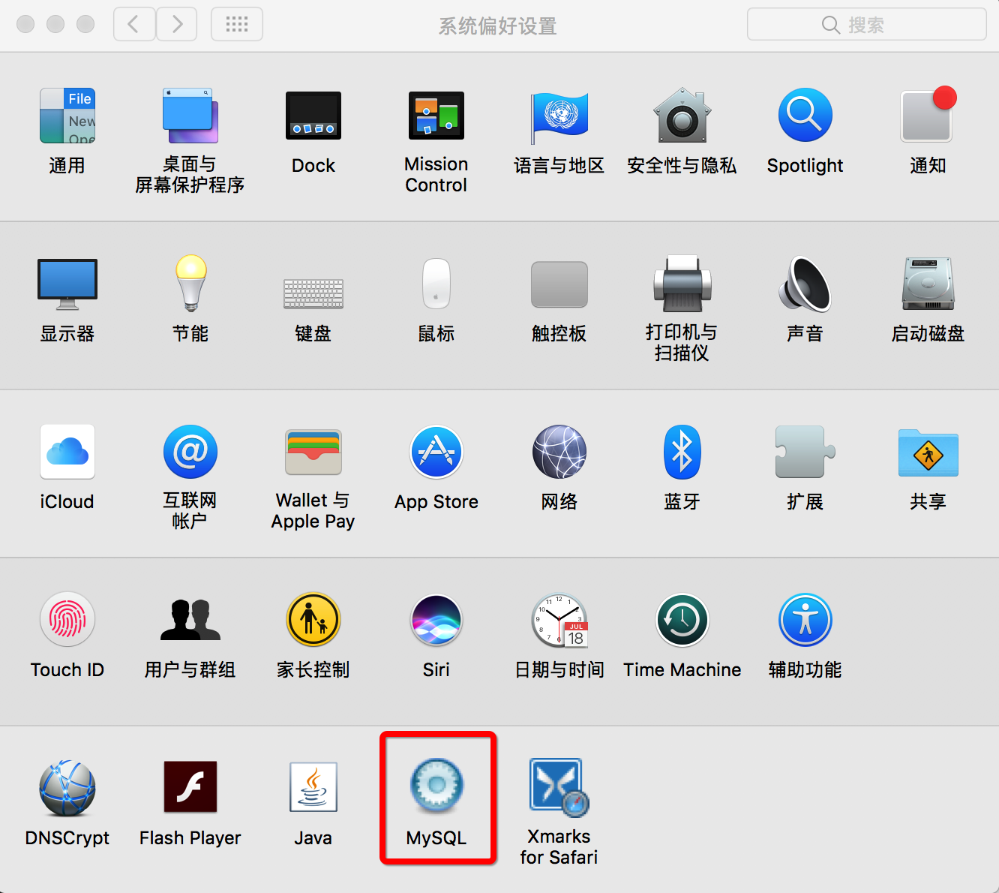

#Mac 搭建PHP+Apache+MySQL 环境

##Apache
Mac自带了Apache，Apache的网站服务器根目录在/Library/WebServer/Documents路径下

###查看Apache版本

```
httpd -v

Server version: Apache/2.4.25 (Unix)
Server built:   Feb  6 2017 19:34:08
```

###启动Apache，如下，在浏览器输入http://localhost,出现It's works！就是成功了

```
sudo apachectl start 
```

###关闭Apache

```
sudo apachectl stop
```
###重启Apache

```
sudo apachectl restart
```

##PHP
Mac也自带了PHP。
###使Apache支持php

配置文件位置：/etc/apache2/httpd.conf


```
sudo vim /etc/apache2/httpd.conf
将 ‘#LoadModule php5_module libexec/apache2/libphp5.so’ 的#号去掉
```

###通过php.ini来配置各种PHP功能
```
sudo cp /etc/php.ini.default /etc/php.ini
```

###验证php

```
cd /Library/WebServer/Documents
sudo vim test.php
```
添加：<?php phpinfo(); ?> 进test.php文件
在浏览器输入：http://localhost/test.php
看见php信息就是正常可用了。

##MYSQL
### [下载MySQL安装包](https://dev.mysql.com/downloads/mysql/)
安装过程完成后，会提供一个初始密码，务必要记着方便后面改密码用。


安装完成后，进入~/.zshrc，添加mysql别名方便使用

```
alias mysql='/usr/local/mysql/bin/mysql'
alias mysqladmin='/usr/local/mysql/bin/mysqladmin'
```

在终端运行MySQL (mysql -uroot -p)

```
# yancey_chan @ chenyuanshandeMacBook-Pro in ~ [23:52:31] C:1
$ mysql -uroot -p
Enter password:
Welcome to the MySQL monitor.  Commands end with ; or \g.
Your MySQL connection id is 27
Server version: 8.0.0-dmr MySQL Community Server (GPL)

Copyright (c) 2000, 2016, Oracle and/or its affiliates. All rights reserved.

Oracle is a registered trademark of Oracle Corporation and/or its
affiliates. Other names may be trademarks of their respective
owners.

Type 'help;' or '\h' for help. Type '\c' to clear the current input statement.
```


###卸载MySQL的方法
```
1 sudo rm /usr/local/mysql
2 sudo rm -rf /usr/local/mysql*
3 sudo rm -rf /Library/StartupItems/MySQLCOM
4 sudo rm -rf /Library/PreferencePanes/My*
5 vim /etc/hostconfig  (and removed the line MYSQLCOM=-YES-)
6 rm -rf ~/Library/PreferencePanes/My*
7 sudo rm -rf /Library/Receipts/mysql*
8 sudo rm -rf /Library/Receipts/MySQL*
9 sudo rm -rf /var/db/receipts/com.mysql.*
```

安装完成后，在系统偏好设置面板可以看见


### [下载MySQL Workbench](https://www.mysql.com/products/workbench/)
####MySQL Workbench是一款专为MySQL设计的ER/数据库建模工具。它是著名的数据库设计工具DBDesigner4的继任者。你可以用MySQL Workbench设计和创建新的数据库图示，建立数据库文档，以及进行复杂的MySQL 迁移。

安装完成第一次打开，会要求输入SQL安装时提供的初始密码，接着就可以修改密码了。


##PHPmyadmin
####phpMyAdmin 是一个以PHP为基础，以Web-Base方式架构在网站主机上的MySQL的数据库管理工具，让管理者可用Web接口管理MySQL数据库。

###使用方法
* 下载phpMyAdmin。选择合适的版本。解压！
* 把phpMyAdmin-3.32-all-languages文件夹复制到“/Library/WebServer/Documents”中，名改名为phpmyadmin。（移动到自己设置的web根目录下即可）
* 复制一份phpmyadmin的配置文件然后编辑它

```
cd phpmyadmin
sudo cp config.sample.inc.php config.inc.php
sudo vi config.inc.php
```

* 把$cfg['Servers'][$i]['host']的值从localost修改为127.0.0.1即可。再登录,OK，正常进入了！


####在浏览器输入  http://localhost/phpmyadmin  填写之前MySQL的账号root，密码******，就能进入了！


