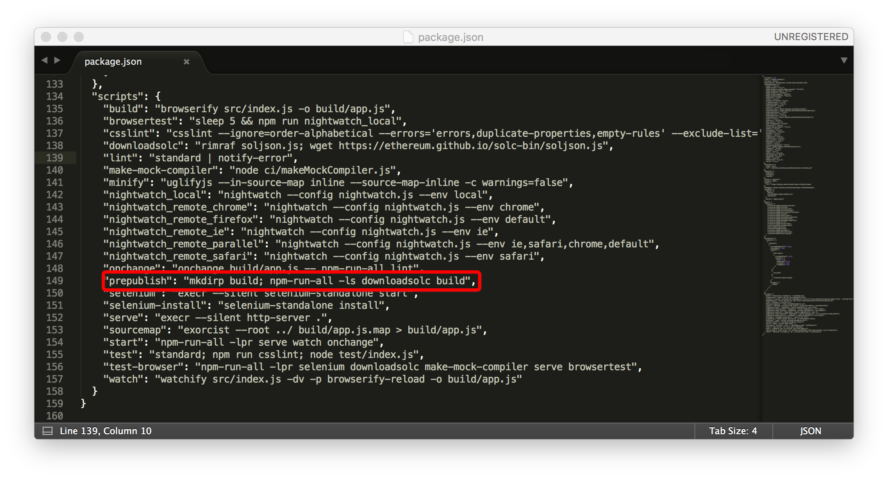
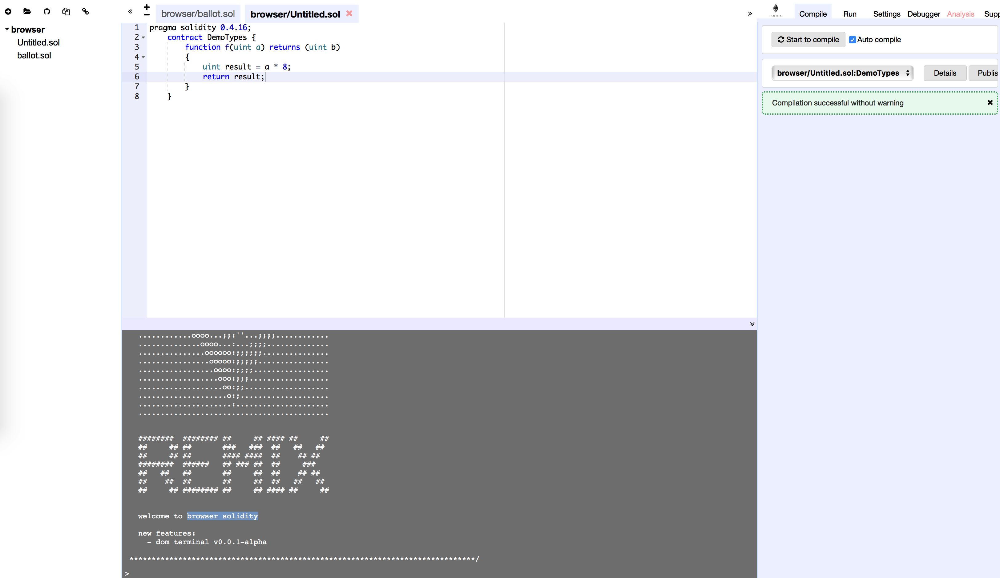
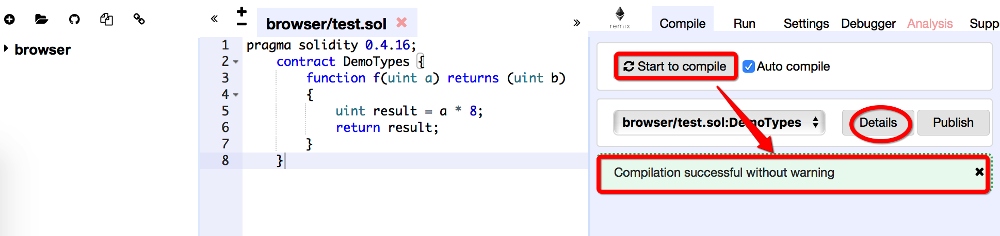
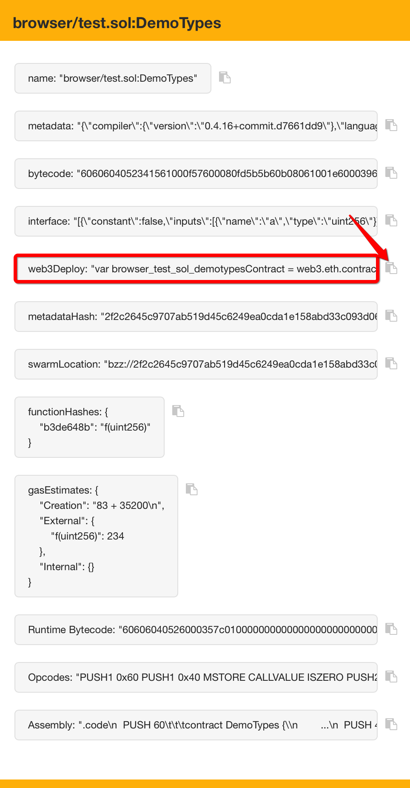

# 本地部署 Browser Solidity

## 本章介绍如何将browser solidity 部署到本地

* 从GitHub下载[browser-solidity](https://github.com/ethereum/browser-solidity)到本地；
* 进入browser-solidity文件夹
	 ```cd browser-solidity``` 
	  
* 安装依赖 ```npm install```
* 执行prepublish 脚本 ```npm run prepublish```

	==scripts字段是一个对象。它的每一个属性，对应一段脚本==
	
	
* 运行 ```npm start```
* 在浏览器打开 http://127.0.0.1:8080

### 当所有环节都正常，会显示solidity的编辑界面


当前的npm版本如下：

```
$ node --version
v7.7.3
$ npm --version
4.1.2
$ nvm --version
0.33.2
$ python -V
Python 2.7.10
```

### 输入测试程序
```
pragma solidity 0.4.16;
    contract DemoTypes {
        function f(uint a) returns (uint b) 
        {
            uint result = a * 8;
            return result;
        }
    }
```



点击start to compile。提示编译完成后，我们可以点击Details查看编译详情。


复制web3Deploy到我们的私有网络下，开始部署我们的合约

```
$ geth --datadir "./" console 2>>geth.log
Welcome to the Geth JavaScript console!

instance: Geth/v1.6.7-stable-ab5646c5/darwin-amd64/go1.8.3
coinbase: 0x639502c56684dcc5cbf7ad05e3ae92c51729f0bf
at block: 43 (Tue, 29 Aug 2017 23:33:00 CST)
 datadir: /Users/yancey_chan/Documents/ethereum_test/private1
 modules: admin:1.0 debug:1.0 eth:1.0 miner:1.0 net:1.0 personal:1.0 rpc:1.0 txpool:1.0 web3:1.0

> eth.accounts
["0x639502c56684dcc5cbf7ad05e3ae92c51729f0bf", "0x1a88d66ac8dc22e670c6472e64262cf4f7f5b8ed"]
> user1 = eth.accounts[0]
"0x639502c56684dcc5cbf7ad05e3ae92c51729f0bf"
> personal.unlockAccount(user1)
Unlock account 0x639502c56684dcc5cbf7ad05e3ae92c51729f0bf
Passphrase:
true
> var browser_test_sol_demotypesContract = web3.eth.contract([{"constant":false,"inputs":[{"name":"a","type":"uint256"}],"name":"f","outputs":[{"name":"b","type":"uint256"}],"payable":false,"stateMutability":"nonpayable","type":"function"}]);
undefined
> var browser_test_sol_demotypes = browser_test_sol_demotypesContract.new(
...    {
......      from: web3.eth.accounts[0],
......      data: '0x6060604052341561000f57600080fd5b5b60b08061001e6000396000f30060606040526000357c0100000000000000000000000000000000000000000000000000000000900463ffffffff168063b3de648b14603d575b600080fd5b3415604757600080fd5b605b60048080359060200190919050506071565b6040518082815260200191505060405180910390f35b6000806008830290508091505b509190505600a165627a7a723058202f2c2645c9707ab519d45c6249ea0cda1e158abd33c093d06a2975e26599af560029',
......      gas: '4700000'
......    }, function (e, contract){
......     console.log(e, contract);
......     if (typeof contract.address !== 'undefined') {
.........          console.log('Contract mined! address: ' + contract.address + ' transactionHash: ' + contract.transactionHash);
.........     }
......  })
null [object Object]
undefined
> miner.start()
null
> null [object Object]
Contract mined! address: 0xe2a8aba6ef545c5ef44a5bd4b2b56a1e1f698df0 transactionHash: 0x0315305077945dfe65c7d3e1e93b9d9b4ec14036079e737a22d5284446cdd07c
> miner.stop()
true
> browser_test_sol_demotypes.f.call(100)
800

> browser_test_sol_demotypes
{
  abi: [{
      constant: false,
      inputs: [{...}],
      name: "f",
      outputs: [{...}],
      payable: false,
      stateMutability: "nonpayable",
      type: "function"
  }],
  address: "0xe2a8aba6ef545c5ef44a5bd4b2b56a1e1f698df0",
  transactionHash: "0x0315305077945dfe65c7d3e1e93b9d9b4ec14036079e737a22d5284446cdd07c",
  allEvents: function(),
  f: function()
}

> eth.getTransaction('0x0315305077945dfe65c7d3e1e93b9d9b4ec14036079e737a22d5284446cdd07c')
{
  blockHash: "0x8b69a1fe8d73b69a0c56ab70e7a208a22f6708a11070ec4bf888e5f17a0d87c4",
  blockNumber: 55,
  from: "0x639502c56684dcc5cbf7ad05e3ae92c51729f0bf",
  gas: 4700000,
  gasPrice: 18000000000,
  hash: "0x0315305077945dfe65c7d3e1e93b9d9b4ec14036079e737a22d5284446cdd07c",
  input: "0x6060604052341561000f57600080fd5b5b60b38061001e6000396000f30060606040526000357c0100000000000000000000000000000000000000000000000000000000900463ffffffff168063b3de648b14603d575b600080fd5b3415604757600080fd5b605b60048080359060200190919050506071565b6040518082815260200191505060405180910390f35b6000806008600a84020390508091505b509190505600a165627a7a723058200c66bfe6f9722e42de9978fdfd25e9db309c9011dfea22773f1d0ca5bc67f2f20029",
  nonce: 4,
  r: "0x5c5d711aeb40726b554d25bcf56d9a21eebd3972d65f1f68be99182a51e736a8",
  s: "0x22b2fb5d4aaa39403286cdde15b1214d3c67b65d3fe70055ab3300df013db024",
  to: null,
  transactionIndex: 0,
  v: "0x42",
  value: 0
}

```

* ```personal.unlockAccount(user1)``` 将我们的账户解锁
* 复制之前的web3Deploy内容
* 进行挖矿（这样合约才会部署到我们的网络上）
	```Contract mined! address: 0x3f03785e5e61808fecd1fddb3827c956dd1aca6c transactionHash: 	0xb9f8d8e2de0ae92436f262993f2ec3731a80571db6a31a9e121571fd2e83aa16
	```
* ```browser_test_sol_demotypes.f.call(100)``` 执行合约
* browser_test_sol_demotypesContract 定义一个contract类，browser_test_sol_demotypes为这个类的一个实例。实例中有我们定义的f function。


	
	