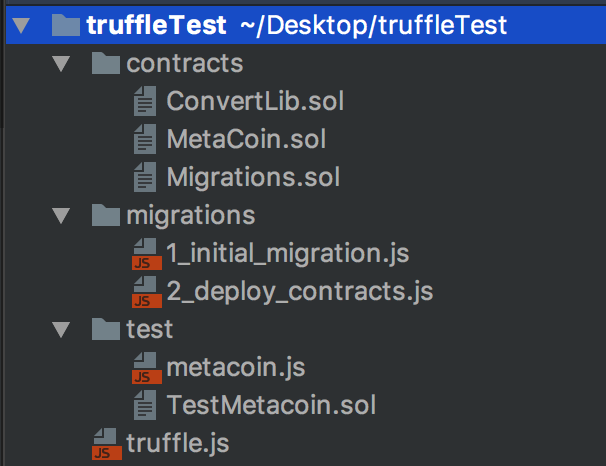

# 安装Ethereumjs和Truffle

### 安装Truffle

```npm install -g truffle```

### 安装ethereumjs

```npm install -g ethereumjs-testrpc``` 

### 创建工程

安装完上面2个后，新建一个文件夹，进入到我们的新建文件下里面，用命令行输入```truffle init```

这样，我们可以看见文件里面创建的目录结构如下



```
Once completed, you'll now have a project structure with the following items:

contracts/ - directory where Truffle expects to find solidity contracts.
migrations/ - directory to place scriptable deployment files.
test/ - location of test files for testing your application and contracts.
truffle.js - your main Truffle configuration file.
```

### 编译工程

```
$ truffle compile
Compiling ./contracts/ConvertLib.sol...
Compiling ./contracts/MetaCoin.sol...
Compiling ./contracts/Migrations.sol...
Writing artifacts to ./build/contracts
```

### 启动testrpc

```
$ testrpc
```

### truffle migrate
```
truffle migrate
```
### 启动服务

```
truffle serve
```

可怕的事情发生了

```
Serving static assets in ./build on port 8080...
/usr/local/lib/node_modules/truffle/build/cli.bundled.js:115605
  return (new fsevents(path)).on('fsevent', callback).start();
          ^

TypeError: fsevents is not a constructor
    at createFSEventsInstance (/usr/local/lib/node_modules/truffle/build/cli.bundled.js:115605:11)
    at setFSEventsListener (/usr/local/lib/node_modules/truffle/build/cli.bundled.js:115659:16)
    at FSWatcher.FsEventsHandler._watchWithFsEvents (/usr/local/lib/node_modules/truffle/build/cli.bundled.js:115823:16)
    at FSWatcher.<anonymous> (/usr/local/lib/node_modules/truffle/build/cli.bundled.js:115957:25)
    at gotStat (fs.js:1785:21)
    at FSReqWrap.oncomplete (fs.js:152:21)
```

原来truffle的最新版本（3.4.9），在这个版本有这个问题出现。网上又说把truffle的版本换成3.2.1可以解决这个问题，但是我换了之后还是没有解决。很多很多天之后，我又发现了一个解决方法[官网问题地址](https://github.com/trufflesuite/truffle/issues/448)。
里面有人提到用这样一个地址[https://github.com/trufflesuite/truffle-init-webpack](https://github.com/trufflesuite/truffle-init-webpack)

按照里面的方法，我们重新用truffle初始化

```
truffle init webpack
```

```
First run truffle compile, then run truffle migrate to deploy the contracts onto your network of choice (default "development").

Then run npm run dev to build the app and serve it on http://localhost:8080
```

最后，我们在浏览器上面打开http://localhost:8080，可以看见下面的界面


truffle 和Ethereumjs 安装成功。
