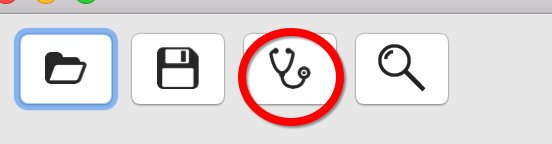

#自动化测试之--appium的安装
###为什么要用appium？
具体的请百度吧。
###开始安装
####方法1
 * 首先要安装node.js  (建议用nvm控制node版本，删除原来安装的node，再用nvm下载要用的版本 2017.6.25 添加）
 
 ```
 brew install node
 ```
 接着使用npm安装我们的appium
 
 ```
 npm install -g appium
 ```

当然过程有限艰辛，反正我在公司和在家装了N久都没装上。最后连上手机4G到时候一下装好了。
安装过程中，有可能会有一个错误，当时候没截图，忘记具体错误原因是什么了。反正我卸载了node，再重装node之后，错误就没再出现过了。

安装好之后，运行

```
➜  ~ appium &
[1] 8575
➜  ~ [Appium] Welcome to Appium v1.6.3
[Appium] Appium REST http interface listener started on 0.0.0.0:4723
```

安装成功！

接着我们安装appium-doctor来看看我们的appium环境怎么样

```
npm install -g appium-doctor

最后我的npm安装list是这样的
├── appium@1.6.3
├── appium-doctor@1.4.2
```

接着执行
```
appium-doctor
```

最后应该是这样的，不过，中途应该还要配置下JAVA_HOME, Carthage。

```
brew install carthage
vim ~/.bash_profile
添加以下内容
export JAVA_HOME=$(/usr/libexec/java_home)
export PATH=$JAVA_HOME/bin:$PATH
export CLASS_PATH=$JAVA_HOME/lib

```

基本大功告成了！
####方法2
[安装appium.dmg](http://appium.io) 
或者使用brew cask  不过这个也是一个很慢的过程。没强迫症的直接去下载dmg吧。

```
brew cask install appium
```
安装后，打开appium.app


左边第三个按钮运行doctor

```
'/Applications/Appium.app/Contents/Resources/node/bin/node' '/Applications/Appium.app/Contents/Resources/node_modules/appium-doctor/appium-doctor.js'
➜  ~ '/Applications/Appium.app/Contents/Resources/node/bin/node' '/Applications/Appium.app/Contents/Resources/node_modules/appium-doctor/appium-doctor.js'
info AppiumDoctor ### Diagnostic starting ###
info AppiumDoctor 
 ✔ Xcode is installed at: /Applications/Xcode.app/Contents/Developer
[Error: Could not detect Mac OS X Version from sw_vers output: '10.12.3
']
```
会出现这个错误。

[使用这里的方法（超级详细！）](http://stackoverflow.com/questions/40129794/how-to-fix-error-could-not-detect-mac-os-x-version-from-sw-vers-output-10-12)

```
➜  ~ vim /Applications/Appium.app//Contents/Resources/node_modules/appium/node_modules/appium-support/build/lib/system.js
➜  ~ vim /Applications/Appium.app//Contents/Resources/node_modules/appium/node_modules/appium-support/lib/system.js
➜  ~ vim /Applications/Appium.app//Contents/Resources/node_modules/appium-support/build/lib/system.js
➜  ~ vim /Applications/Appium.app//Contents/Resources/node_modules/appium-support/lib/system.js
...
```

之后，再次运行doctor


搞定！


