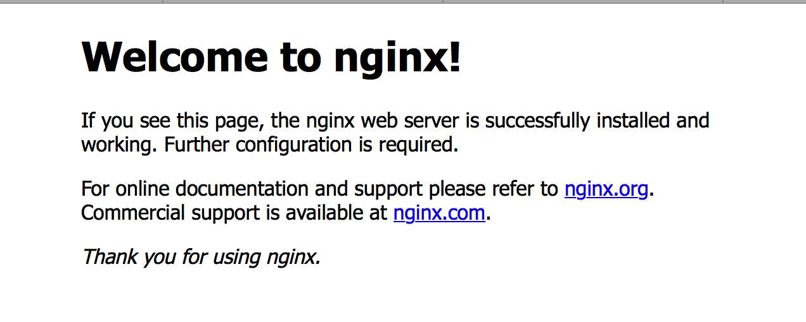

# 搭建服务器相关设置

## 服务器信息
* IP address:	65.49.196.2
* SSH Port:	26773

## 域名
* yancey.cf

## shadowsocks
[shadowsocks](https://github.com/shadowsocks/shadowsocks/wiki)
现在搬瓦工已经可以一键搭建shadowsocks了，很方便。如果我们想设置多用户或者是修改默认配置的端口和密码，就需要自己动手操作了。

### 修改shadowsocks.json

```
vi /etc/shadowsocks.json
```

单用户配置

```
{
    "server":"my_server_ip",
    "server_port":8388,
    "local_address": "127.0.0.1",
    "local_port":1080,
    "password":"mypassword",
    "timeout":300,
    "method":"aes-256-cfb",
    "fast_open": false
}
```

多用户配置

```
{
    "server": "0.0.0.0",
    "port_password": {
        "8381": "foobar1",
        "8382": "foobar2",
        "8383": "foobar3",
        "8384": "foobar4"
    },
    "timeout": 300,
    "method": "aes-256-cfb"
}
```

### 设置开机启动
普通的前台启动(可见日志)

```
ssserver -c /etc/shadowsocks.json
```

后台启动和停止

```
ssserver -c /etc/shadowsocks.json -d start
ssserver -c /etc/shadowsocks.json -d stop
```

rc.local脚本是在系统初始化级别脚本运行之后再执行的，因此可以安全地在里面添加你想在系统启动之后执行的脚本。

```
vi /etc/rc.local
```
带有ssserver的那行注释掉，接着添加下面的命令

```
ssserver -c /etc/shadowsocks.json -d start
```


## 安装常用工具

首先更新yum

```
yum install epel-release
yum update
yum -y install wget
yum install git
```

查看使用的端口 ```netstat -tpln```


## ssh登录相关

### 密码登录

``` 
ssh -p '26773' 'root@65.49.196.2' //-p 端口号

//第一次登录时
The authenticity of host '[65.49.196.2]:26773 ([65.49.196.2]:26773)' can't be established.
RSA key fingerprint is SHA256:N/OrJGXJ25VbxCvYxOe5gKk3Tb8sjoVIA/4vMrrMkDo.
Are you sure you want to continue connecting (yes/no)? yes
Warning: Permanently added '[65.49.196.2]:26773' (RSA) to the list of known hosts. //这个时候会将服务器给的公钥保存到knowhosts里面。
```

没设置免密码登录时，输入完上面的命令后，会要求我们输入服务器的密码

### 免密码登录
原理就是客户端生成一对公私钥，将公钥传给服务器。登录的时候，服务器会发送一段随机的字符串给客户端，客户端加密后，返回给服务器，服务器通过公钥解密，成功后就登录成功。

客户端生成公钥

```
ssh-keygen remote_service_rsa
```

之后，在~/.ssh下，就会生成2个文件 remote_service_rsa, remote_service_rsa.pub
我们把公钥传到服务器上

```
ssh-copy-id -i id_rsa.pub root@65.49.196.2 -p 26773
```

如果还是不行，就打开远程主机的/etc/ssh/sshd_config这个文件，检查下面几行前面"#"注释是否取掉

```
RSAAuthentication yes
PubkeyAuthentication yes
AuthorizedKeysFile .ssh/authorized_keys
StrictModes no
```

重启ssh服务

```
service sshd restart
```

默认公密钥的文件名是id_rsa，如果你有多个公密钥，可能需要你在ssh连接服务器的时候，手动指定使用哪个密钥 

```
ssh -p '26773' 'root@65.49.196.2' -i ~/.ssh/remote_service_rsa
```

#### 使用别名登录
在客户端本地，设置 ```vim ~/.ssh/config``` 文件

```
# --- Remote Service ---
Host remote
        HostName 65.49.196.2
        Port 26773
        User root
        PreferredAuthentications publickey
        IdentityFile /Users/yancey/.ssh/remote_service_rsa
        IdentitiesOnly yes
# --------------------------
```
接着使用 ```ssh remote``` 就可以免密码登录


### REMOTE HOST IDENTIFICATION HAS CHANGED! 
客户端第一次登录服务器的时候，客户端会保存服务器给我们的一个公钥。每次我们登录的时候，我们会将服务器密码通过公钥加密传送回给服务器，服务器通过私钥解密，判断密码是否正确，决定是否能够登录。这就是ssh登录的过程。有时候因为服务器重装之类的问题，服务器保存的那对公私钥发生了变化，跟我们客户端保存的公钥不一样了，所以就会出现下面的问题。

```
# yancey @ Yancey in ~ [9:30:20]
$ ssh root@65.49.196.2 -p 26773
@@@@@@@@@@@@@@@@@@@@@@@@@@@@@@@@@@@@@@@@@@@@@@@@@@@@@@@@@@@
@    WARNING: REMOTE HOST IDENTIFICATION HAS CHANGED!     @
@@@@@@@@@@@@@@@@@@@@@@@@@@@@@@@@@@@@@@@@@@@@@@@@@@@@@@@@@@@
IT IS POSSIBLE THAT SOMEONE IS DOING SOMETHING NASTY!
Someone could be eavesdropping on you right now (man-in-the-middle attack)!
It is also possible that a host key has just been changed.
The fingerprint for the RSA key sent by the remote host is
SHA256:FCDvK4FQXvZOlv4uaGZeLtBtGo/pwUGFflmaiFSFBsg.
Please contact your system administrator.
Add correct host key in /Users/yancey/.ssh/known_hosts to get rid of this message.
Offending RSA key in /Users/yancey/.ssh/known_hosts:8
RSA host key for [65.49.196.2]:26773 has changed and you have requested strict checking.
Host key verification failed.
```

解决方法：

查找~/.ssh/known_hosts文件夹里面保存的公钥

```
ssh-keygen -l -f ~/.ssh/known_hosts //显示公钥文件的指纹数据 -f input_keyfile

2048 SHA256:FCDvK4FQ5Redsv4uaGZeLtBtGo/pwUGFflmaiFSFBsg [65.49.196.2]:26773 (RSA)
```

从 known_hosts 文件中删除所有属于 hostname 的密钥（这里的hostname为上面查到的：[65.49.196.2]:26773）

```
ssh-keygen -R 服务器端的ip地址

# Host [65.49.196.2]:26773 found: line 8
/Users/yancey/.ssh/known_hosts updated.
Original contents retained as /Users/yancey/.ssh/known_hosts.old
```

再次登录即可。

###  UNPROTECTED PRIVATE KEY FILE!

登录服务器的密钥不是默认的id_rsa,就要指定使用哪个密钥登录。可能会出现下面的情况

```
@@@@@@@@@@@@@@@@@@@@@@@@@@@@@@@@@@@@@@@@@@@@@@@@@@@@@@@@@@@
@         WARNING: UNPROTECTED PRIVATE KEY FILE!          @
@@@@@@@@@@@@@@@@@@@@@@@@@@@@@@@@@@@@@@@@@@@@@@@@@@@@@@@@@@@
Permissions 0644 for 'remote_service_rsa.pub' are too open.
It is required that your private key files are NOT accessible by others.
This private key will be ignored.
Load key "remote_service_rsa.pub": bad permissions
```

大概意思就是说密钥权限的文件不能为777，不能被其他用户读取。
了解了问题后，修改密钥文件权限为700就OK了```chmod 700 fileName```

## 安装Node.js
```
wget -qO- https://raw.github.com/creationix/nvm/master/install.sh | sh
```

安装完成后，用nvm管理我们的node版本吧~


## NGINX

### 安装nginx
我用的是CentOS6的版本，在nginx网站里面找到的[安装指南](https://www.nginx.com/resources/wiki/start/topics/tutorials/install/)

在服务器/etc/yum.repos.d/文件夹里面，新建一个nginx.repo文件

```
cd /etc/yum.repos.d/
vim nginx.repo
```

在nginx.repo文件中，加入下面的内容并保存

```
[nginx]
name=nginx repo
baseurl=http://nginx.org/packages/centos/$releasever/$basearch/
gpgcheck=0
enabled=1
```

之后我们就可以用yum安装nginx了

```yum install -y nginx```

然后直接用命令启动nginx

```nginx```

这时候，如果我们访问我们的服务器， 应该可以看见nginx的欢迎界面。


如果访问失败了，那可能是防火墙屏蔽了80端口造成的。

先查看防火墙状态

```
# /etc/init.d/iptables status
Table: filter
Chain INPUT (policy ACCEPT)
num  target     prot opt source               destination

Chain FORWARD (policy ACCEPT)
num  target     prot opt source               destination

Chain OUTPUT (policy ACCEPT)
num  target     prot opt source               destination
```
试用下面的命令打开80端口

```iptables -I INPUT -p tcp --dport 80 -j ACCEPT```


再查看防火墙状态

```
# /etc/init.d/iptables status
Table: filter
Chain INPUT (policy ACCEPT)
num  target     prot opt source               destination
1    ACCEPT     tcp  --  0.0.0.0/0            0.0.0.0/0           tcp dpt:80

Chain FORWARD (policy ACCEPT)
num  target     prot opt source               destination

Chain OUTPUT (policy ACCEPT)
num  target     prot opt source               destination
```

这时候我们再尝试访问服务器，就可以看见nginx的欢迎界面了

### nginx 常用命令

```
nginx -s reload  ：修改配置后重新加载生效
nginx -s reopen  ：重新打开日志文件
nginx -t -c /path/to/nginx.conf 测试nginx配置文件是否正确

关闭nginx：
nginx -s stop  :快速停止nginx
         quit  ：完整有序的停止nginx

```


### nginx默认目录
```
whereis nginx
nginx: /usr/sbin/nginx /etc/nginx /usr/share/nginx

1 配置所在目录：/etc/nginx/
2 PID目录：/var/run/nginx.pid
3 错误日志：/var/log/nginx/error.log
4 访问日志：/var/log/nginx/access.log
5 默认站点目录：/usr/share/nginx/html
```

### 绑定域名设置根目录
进入配置目录
```cd /etc/nginx/conf.d```

修改默认配置

```
vim default.conf

server {
    listen       80;
    server_name  www.yancey.cf;

    location / {
        root   /usr/share/nginx/html;
        index  index.html;
    }

    error_page   500 502 503 504  /50x.html;
    location = /50x.html {
        root   /usr/share/nginx/html;
    }

}

server {
    listen       80;
    server_name  www.yancey.ga;

    location / {
        root   /usr/share/nginx/html;
        index  index_2.html;
    }

    error_page   500 502 503 504  /50x.html;
    location = /50x.html {
        root   /usr/share/nginx/html;
    }

}
```

其中，server_name 修改为我们的域名， root修改为我们的根目录位置
保存退出，这时候，我们访问www.yancey.cf也能看见nginx的欢迎界面了。
而访问www.yancey.ga，就是我们自定义的一个index__2.html的页面了。


## 防火墙


## 常用的查看命令

##### 列出所有端口 ```netstat -ntlp```

#### 查看当前防火墙规则 ```/etc/init.d/iptables status```


