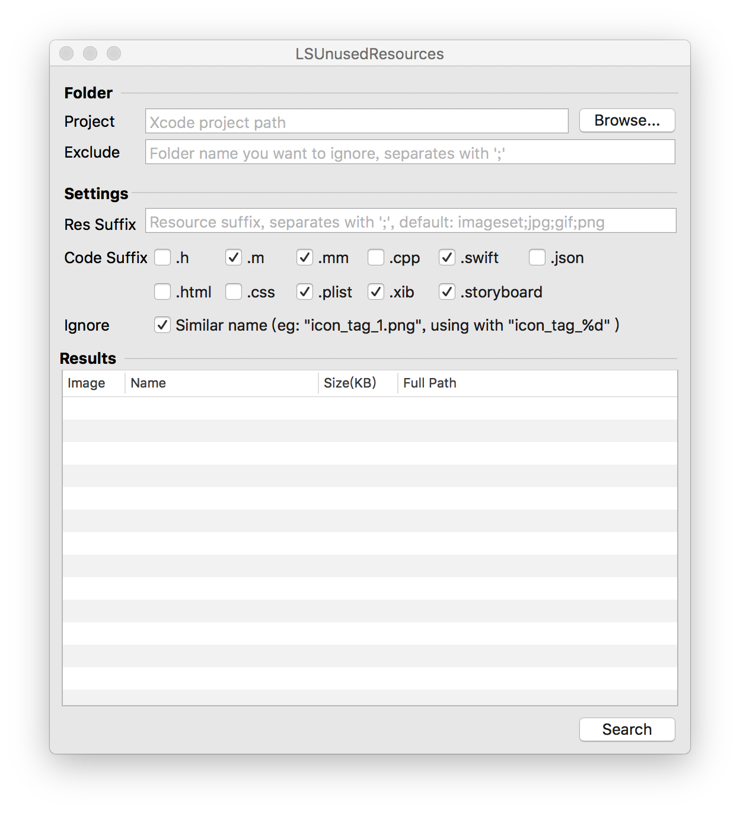

#查找工程中无用重复图片

##查找重复图片
额，在网上找了下，看见有人用oc直接写了个程序查，方便，搬过来直接用了：

```
NSFileManager *fileManager = [NSFileManager defaultManager];
    NSError *error = nil;
    NSArray *fileList = [[NSArray alloc] init];
    //fileList便是包含有该文件夹下所有文件的文件名及文件夹名的数组
    fileList = [fileManager subpathsOfDirectoryAtPath:@"/Users/yancey/Documents/Git仓库/zywallet_app_Optimization/ZYWallet_iOS/ZYWallet/Assets.xcassets" error:&error];
    for (NSString * str in fileList) {
        if ([str containsString:@"/"]) {
            NSString * temp = [str componentsSeparatedByString:@"/"].lastObject;
            if ([temp containsString:@".png"]) {
                for (NSString * str2 in fileList)
                {
                    if ([str isEqualToString:str2]) {
                        continue;
                    }else{
                        NSString * temp2 = [str2 componentsSeparatedByString:@"/"].lastObject;
                        if ([temp isEqualToString:temp2]) {
                            NSLog(@"\n---------------\nImage:  %@ \nImage2: %@\n",str,str2);
//                            NSLog(@"~~~~~~~~~~~~~~~~~~~");
                        }
                    }
                }
            }
        }else{
        }
    }
```

##查找无用图片
 * 网上找的脚步，但是感觉得出的结果不怎么正确，很多没用的图片都没有找出来

```
#!/bin/sh  
PROJ=`find . -name '*.xib' -o -name '*.[mh]'`  
  
for png in `find . -name '*.png'`  
do  
    name=`basename $png`  
    if ! grep -qhs "$name" "$PROJ"; then  
        echo "$png is not referenced"  
    fi  
done
```

 * [Unused](http://jeffhodnett.github.io/Unused/)
https://github.com/jeffhodnett/Unused

貌似也是用上面的脚本做的图形化界面，结果还是不正确

 * [LSUnusedResources](https://github.com/summerHearts/LSUnusedResources)

 
 使用方法和Unused差不多，但是感觉查出来的结果，正确率要高一些。
 
 查出来的结果还要人工查看下是不是真的没有使用到哦~
