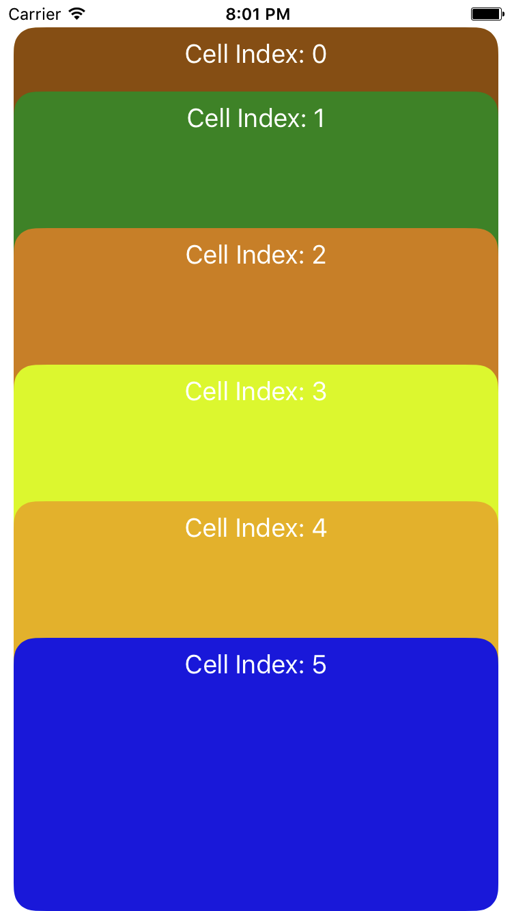

# 自定义UICollectionFlowLayout的坑

## 总结下最近项目里面遇到的一个坑

最近在项目里面，要实现一个类似下面的一个卡片叠加的效果。

这些的demo在网上找到一个类似的，加以改造就符合项目的需求要达到的效果。本来想着这个坑就这样过去了，谁知道，需求里面要在卡片的下面添加一行文字，提醒用户可以拖动卡片的功能。本来以为只要在collectionView里面加个footer就能完事，但是实际开始干的时候，发现footer死活不出现。

本来应该只要添加下面的代码，footer就应该乖乖的出现的：
引用下网上的添加UIColletionView footerView 的方法

```
layout.headerReferenceSize = CGSizeMake(fDeviceWidth, 200);//头部

[collectView registerNib:[UINib nibWithNibName:NSStringFromClass([PZFlowCollectionHeaderView class]) bundle:nil] forSupplementaryViewOfKind:UICollectionElementKindSectionHeader withReuseIdentifier:PZFlowCollectionHeaderViewIdentifierID];
        
```

在UIColletionFlowLayout添加headerReferenceSize属性，在collectionview注册SupplementaryView。再用CollectionView 的Delegate设置好就能添加UICollectionView的footerView了。但是，自定义的FlowLayout就会出现不显示的问题。

经过多番的搜索，发现了一种方法，要在自定义的FlowLayout里面设置footer 的属性。代码如下：(footer和header一样设置，位置不同而已）

```
- (void)prepareLayout{
  [super prepareLayout];
  _attributeArray = [NSMutableArray array];
  //头部视图
    UICollectionViewLayoutAttributes * layoutHeader = [UICollectionViewLayoutAttributes layoutAttributesForSupplementaryViewOfKind:UICollectionElementKindSectionHeader withIndexPath:[NSIndexPath indexPathWithIndex:0]];
    layoutHeader.frame =CGRectMake(0,0, self.headerReferenceSize.width, self.headerReferenceSize.height);
    [self.attrsArray addObject:layoutHeader];

    //item内容视图
    NSInteger count = [self.collectionView numberOfItemsInSection:0];
    for (int i = 0; i<count; i++) {
        UICollectionViewLayoutAttributes *attrs = [self layoutAttributesForItemAtIndexPath:[NSIndexPath indexPathForItem:i inSection:0]];
        [self.attrsArray addObject:attrs];
    }
}

- (UICollectionViewLayoutAttributes *)layoutAttributesForItemAtIndexPath:(NSIndexPath *)indexPath{
 	//这里设置item的attribute。   
}

- (NSArray<UICollectionViewLayoutAttributes *> *)layoutAttributesForElementsInRect:(CGRect)rect{
  return _attributeArray;
}

```

这里等于将原来item的attribute列表再加上了我们要添加的Header/Footer。在将最后的这个列表展示出来。

然而，问题还没有这么快结束。由于需求里面加载数据后要刷新CollectionView，一刷新，上面的写法就会出现问题。本来在demo上测试号的代码，移植到项目代码上就不好使了。应该是由于item的数目为0的时候布局出错了。

最后，最后，经过无数次尝试，发现如下的写法，不会再出现问题：

```
- (NSArray<UICollectionViewLayoutAttributes *> *)layoutAttributesForElementsInRect:(CGRect)rect {

	NSInteger rows = [self.collectionView numberOfItemsInSection:0];
    //之前的布局代码下面添加如下内容 attrs里面已经存有items的布局属性。
    if (rows != 0) {
        UICollectionViewLayoutAttributes * layoutHeader = [UICollectionViewLayoutAttributes
                                                           layoutAttributesForSupplementaryViewOfKind:UICollectionElementKindSectionFooter
                                                           withIndexPath:[NSIndexPath indexPathWithIndex:0]];
        layoutHeader.frame =CGRectMake(0,self.collectionViewContentSize.height - 44 , self.collectionView.frame.size.width - inset.left - inset.right ,44);
        [attrs addObject:layoutHeader];
    }
    return attrs;
}

```

好了，大功告成！ 最后footer终于出现。一个完全想不到的bug，最后多花了我一天时间


